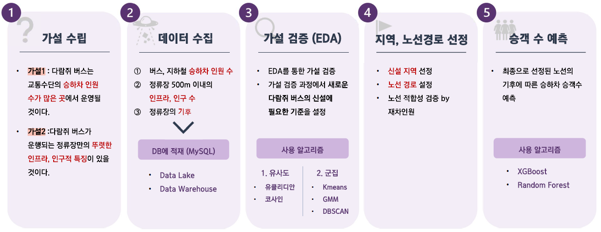

  
        

## 📂 프로젝트 개요
**[프로젝트명]** 다람쥐 버스의 신설 노선 제시

**[기간]** 2023.06.20 - 2023.07.31

**[팀 구성원]**
- 프로젝트 조: Multicampus Final project 3조
- 프로젝트 구성원 : 양충모, 김은비, 김지연, 서정식   
  
**[프로젝트 배경]** 
- 기존 다람쥐 버스 도입 후 혼잡 빈도 35% 감소, 평균 이용자수 264% 급증
- 다람쥐 버스 노선의 신설에 대한 긍정적인 여론 (신설 찬성: 95.8%)

**[설명]**

- 다람쥐 버스는 출근 시간대(7-9시)에 승객이 많이 몰리는 특정 구간을 반복 운행하는 출근 맞춤형 버스입니다.
- 해당 프로젝트는 현재 운행 중인 다람쥐 버스의 특을 분석하고, 다람쥐 버스의 새로운 노선을 정하는 프로젝트 입니다. 프로젝트는 크게 두가지 목표를 지니고 있습니다.
    1. 새로운 지역을 선정
    2. 새로운 지역 내에서 운행될 신설 노선의 경로를 설정
      
  
 

**[진행 과정]**

  

## 🎁 프로젝트를 통해 얻은 것, 느낀점
- 대용량 데이터 (약 10억건의 기후 데이터)를 다뤄볼 수 있는 좋은 기회였음

- SQL과 Spark SQL을 통해 대용량 데이터를 조회, 정제하는 경험을 함

- 직접 DB를 구축해보면서 Data Lake, Warehouse 설계의 중요성을 느낌

- 해당 프로젝트에서 사람이 직접 개입하여 분석해야하는 단계가 불가피하다는특성때문에 파이프라인을 구축하진 못했지만 파이프라인이 업무의 속도와 편리함을 증진시킨다는 것을 절실히 느꼈고, 추후 프로젝트를 진행할 때는 파이프라인 구축을 염두에 두고 진행할 것

- EDA과정에서 여러 시행착오를 겪으며 다양한 알고리즘과 툴을 접할 수 있어서 좋았음

 

## 🗒️모듈 & 노트북 설명

### [Data](./src/Data/)

- [Extract.py](./src/Data/Extract.py): 데이터 수집
- [preprocessing.py](./src/Data/preprocessing.py): 수집된 통계, 인프라, 버스 데이터를 전처리하여 1차 분석에 필요한 데이터 프레임 반환
- [bus_preprocessing.py](./src/Data/bus_preprocessing.py) : 공공데이터에서 수집한 버스 데이터 전처리
- [preprocessing_regression.py](./src/Data/preprocessing_regression.py): 회귀 데이터의 전처리

### [EDA](./src/EDA/)
- [EDA_STEP_1.py](./src/02_EDA1.ipynb): 기-종점 거리 구하기
- [folium.py](./src/EDA/folium.py): 폴리엄
- [visualization.py](./src/EDA/visualization.py): EDA 그래프 시각화
  

### [Modeling](./src/Modeling/)
- [similarity.py](./src/Modeling/similarity.py): EDA 1차에 사용된 유사도 알고리즘(유클리디안, 코사인)
- [clustering.py](./src/Modeling/clustering.py): EDA 1차에 사용된 군집 알고리즘(KMeans, GMM, DBSCAN)
- [regression.py](./src/Modeling/regression.py): 회귀 알고리즘(XGBoost, Random Forest)

### Notebook
- [01_preprocessing.ipynb](./src/01_preprocessing.ipynb) : 데이터 전처리 과정
- [02_EDA1.ipynb](./src/02_EDA1.ipynb) : 다람쥐 버스 신설 지역 선정 과정
- [03\_*EDA2*기존경유지분석.ipynb](./src/03_EDA2_기존경유지분석.ipynb) : 노선 경로 선정 과정
- [04_regression.ipynb](./src/04_regression.ipynb) : 기후에 따른 승차 인원 수 예측
